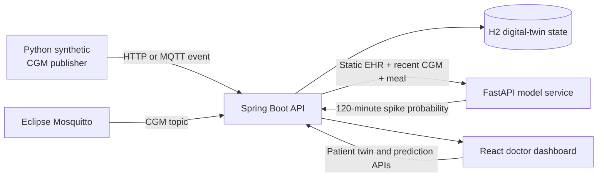

# Prototype Architecture

## Responsibilities

- **Synthetic publisher:** creates fictional CGM events with unique IDs and
  increasing simulated timestamps.
- **Mosquitto:** optional demonstration transport for the CGM stream.
- **Spring Boot:** owns patient identity, validation, event ordering, persistence,
  digital-twin state, model orchestration, and the public application API.
- **FastAPI:** owns live feature calculation, model loading, probability generation,
  and model-factor explanations.
- **React:** presents patient context, signals, prediction status, and limitations.
- **H2:** stores only fictional demonstration data in the prototype.

## Trust boundaries

- The browser cannot call FastAPI or MQTT directly.
- FastAPI receives only the fields needed for prediction.
- Public demo services never read the local ShanghaiT2DM files.
- A stopped or unhealthy model service produces an unavailable result.
- Every displayed record is marked synthetic.

## Deployment

Docker Compose starts Mosquitto, FastAPI, Spring Boot, the CGM publisher, and the
React web server on one developer machine. Only the dashboard and Spring API require
host ports for the demonstration.
