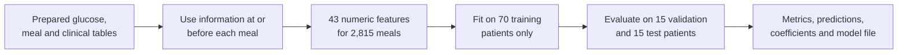

# ShanghaiT2DM Feature Engineering and Baseline Model

## What this stage accomplished

This stage turns the prepared meal and glucose records into model inputs and trains
the first intentionally simple classifier. The code is split into two programs:

- `scripts/build_shanghai_features.py` creates one leakage-safe row per eligible meal.
- `scripts/train_shanghai_baseline.py` trains Logistic Regression and compares it
  with an always-guess-the-majority baseline.



The complete meaning of every input is in the
[feature dictionary](FEATURE_DICTIONARY.md).

## What Logistic Regression means

Despite its name, Logistic Regression is a classification model. It combines the
input features into a probability between 0 and 1. Version 1 predicts “spike” when
that probability is at least 0.5.

It is a good first model because it is quick, reproducible, and easier to inspect
than a neural network. It establishes a **baseline**: a reference result that more
complex models must improve upon.

Before fitting, the pipeline performs two operations using training patients only:

1. **Median imputation** fills a missing feature with the middle training value and
   adds an indicator showing that the original value was missing.
2. **Standardisation** changes each feature to a common numerical scale. This keeps
   large units, such as glucose values, from dominating small units merely because
   their numbers are larger.

## Why a majority comparison is necessary

About 65% of eligible meals have a positive spike label. A program that predicts
“spike” for every meal can therefore obtain deceptively high accuracy and F1 without
learning any physiology. The majority comparator exposes that weakness.

## Verified results

The full pipeline was run on 2026-10-07 with 1,871 training meals, 451 validation
meals, and 493 test meals. Patients do not cross these groups.

### Validation patients

| Metric | Logistic Regression | Always predict spike |
| --- | ---: | ---: |
| Accuracy | 0.670 | 0.701 |
| Balanced accuracy | 0.561 | 0.500 |
| Precision | 0.733 | 0.701 |
| Recall | 0.832 | 1.000 |
| F1 | 0.779 | 0.824 |
| ROC AUC | 0.701 | 0.500 |
| Average precision | 0.860 | 0.701 |
| Brier score | 0.194 | 0.299 |

The majority guess has higher validation accuracy and F1 because positive labels are
very common. It cannot identify a single negative meal. Logistic Regression has
better balanced accuracy, ROC AUC, average precision, and probability error.

### Test patients

| Metric | Logistic Regression | Always predict spike |
| --- | ---: | ---: |
| Accuracy | 0.688 | 0.609 |
| Balanced accuracy | 0.673 | 0.500 |
| Precision | 0.745 | 0.609 |
| Recall | 0.740 | 1.000 |
| F1 | 0.742 | 0.757 |
| ROC AUC | 0.757 | 0.500 |
| Average precision | 0.832 | 0.609 |
| Brier score | 0.195 | 0.391 |

On the held-out test patients, the model correctly identified 222 spike meals and
117 non-spike meals. It produced 76 false alarms and missed 78 spikes.

|  | Predicted no spike | Predicted spike |
| --- | ---: | ---: |
| Actually no spike | 117 | 76 |
| Actually spike | 78 | 222 |

This table is a **confusion matrix**. Its four cells count correct negative results,
false alarms, missed positive results, and correct positive results.

## Metric glossary

- **Accuracy**: fraction of all predictions that are correct. It can mislead when
  one class is much more common.
- **Balanced accuracy**: average accuracy for the positive and negative classes,
  giving them equal importance.
- **Precision**: among predicted spikes, the fraction that truly spike.
- **Recall**: among true spikes, the fraction the model detects.
- **F1**: one score combining precision and recall. It does not measure how well the
  model recognises negative cases.
- **ROC AUC**: how well the model ranks spike meals above non-spike meals across all
  possible thresholds. `0.5` is random ranking; `1.0` is perfect ranking.
- **Average precision**: ranking quality focused on the positive class.
- **Brier score**: average squared probability error. Lower is better.

## How to run this stage

From the repository's top folder:

```powershell
.\.venv\Scripts\python.exe -m pip install -r scripts/requirements-data.txt
.\.venv\Scripts\python.exe -m scripts.build_shanghai_features
.\.venv\Scripts\python.exe -m scripts.train_shanghai_baseline
.\.venv\Scripts\python.exe -m unittest discover -s tests -v
```

Generated files appear in `data/processed/shanghai-t2dm/modeling/`:

| File | Contents |
| --- | --- |
| `model_features.csv` | Identifiers, 43 model inputs, and one target for each eligible meal |
| `feature_report.json` | Row counts, label balance, missingness, split counts, and leakage checks |
| `baseline_metrics.json` | Full training, validation, test, and majority-baseline metrics |
| `baseline_predictions.csv` | Probabilities and classifications for validation and test meals |
| `baseline_coefficients.csv` | Standardised model coefficients sorted by absolute size |

The trained model is written to
`models/shanghai-t2dm/logistic_regression.joblib`. Generated patient-level tables
and model binaries stay local and are ignored by Git.

## How to interpret coefficients safely

A positive coefficient means the feature is associated with a higher model score
while the other inputs are held fixed. A negative coefficient means association
with a lower score. It does not prove that changing that feature would cause glucose
to change.

Many glucose features overlap mathematically—for example, current glucose, recent
mean, lag values, and changes. This is called **multicollinearity**. It can make
individual coefficient sizes unstable even when overall predictions remain useful.
Use coefficients to inspect the model, not as clinical treatment advice.

## Important limits before the next model

- Meal keyword flags are not nutrient measurements. Food-composition mapping is a
  future improvement.
- The initial eligibility rule excludes meals followed closely by another recorded
  meal. That is useful for studying an isolated response, but the absence of a
  future meal would not be known during live prediction.
- Several meals belong to the same patient. Patient-level splitting prevents the
  same person appearing in training and test, but row-level metrics still give
  patients with more meals more influence.
- The threshold of 0.5 has not been clinically selected or calibrated for an alert
  workflow.
- The cohort comes from Shanghai. These results do not establish performance for
  Indian patients or another population.
- This is a research baseline, not a diagnosis, dosing system, or treatment tool.

## Recommended next experiment

Keep the test group untouched while using validation patients to compare:

1. Logistic Regression with a smaller, less correlated glucose feature set.
2. A tree model such as Random Forest or gradient boosting.
3. Better meal features mapped to carbohydrate, protein, fat, fibre, and energy.
4. Patient-level metric summaries and probability calibration.

A new model should be accepted only when it improves useful validation metrics and
its errors remain understandable. The test group should be checked again only after
the modelling choices are fixed.
