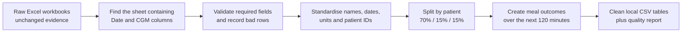

# ShanghaiT2DM Data Preparation — Beginner Guide

## What we are doing now

The project has moved from **finding data** to **making the first dataset safe and
usable for modelling**. We start with ShanghaiT2DM because it contains continuous
glucose readings, timed meals, medication events, and clinical information for
people with Type 2 diabetes. Its source, licence, local location, and integrity
checks are recorded in the [external data inventory](../data/external/README.md).

The preparation program is [`scripts/prepare_shanghai_t2dm.py`](../scripts/prepare_shanghai_t2dm.py).
It reads the downloaded Excel workbooks and creates consistent CSV tables. It does
not edit the original workbooks.



The arrows matter: a later table can always be traced back through the program to
an original workbook, worksheet, and row number.

## Why we do not edit the raw files

Think of the downloaded workbooks as the original evidence. If we manually delete
rows or rename cells inside them, nobody can tell later which values came from the
researchers and which values we changed. Instead:

- `data/external/` holds the downloaded evidence and its inventory.
- `scripts/` holds the repeatable instructions for cleaning it.
- `data/processed/` holds replaceable results made by those instructions.

If a rule changes, we delete or replace the generated result and run the program
again. The raw evidence remains untouched.

## What the program checks

### 1. It identifies the measurement sheet by its fields

The 109 workbooks do not use one reliable worksheet name. Some also contain insulin
pump schedules. The program therefore looks for the single sheet that contains both
`Date` and `CGM (mg / dl)`. This is called **schema-based selection**: choosing data
by its structure rather than by an unreliable label or sheet position.

It then requires all ten expected measurement fields. A changed or incomplete
workbook stops the run with an error instead of silently producing incorrect data.
This behaviour is called **fail fast**.

### 2. It standardises the same idea into the same field

Examples:

- `CGM (mg / dl)` becomes `glucose_mg_dl`.
- Excel date cells become one consistent timestamp format.
- The file name `12_2_20210715` is separated into patient `12`, visit `2`, and the
  recording start date `2021-07-15`.
- Original meal and medication descriptions are retained as raw text so later
  interpretation remains auditable.

**CGM** means continuous glucose monitoring: a wearable sensor estimates glucose
throughout the day. **mg/dL** means milligrams per decilitre, the unit used for the
glucose values in this dataset.

### 3. It rejects unusable observations without hiding them

A valid glucose observation needs both a timestamp and a numeric CGM value. Rows
missing either are written to `rejected_rows.csv` with a reason. They are not thrown
away invisibly. This is an **audit trail**—a record of what happened and why.

### 4. It separates patients before modelling

The program deterministically assigns each of the 100 base patient IDs to:

- about 70% training patients, used to fit a model;
- about 15% validation patients, used to choose modelling settings;
- about 15% test patients, used only for the final honest evaluation.

All visits from one person stay in one group. If readings from the same person were
put in both training and test data, a model could partially recognise that person
instead of learning a rule that generalises. That problem is called **data leakage**.

The random seed is `42`, so every teammate receives the same split when running the
same version of the program.

### 5. It creates one row per recorded meal

For every row containing a dietary entry, the program retains:

- the meal time and original meal description;
- glucose at the meal time, called the **baseline**;
- glucose exactly 120 minutes later, when a reading exists;
- the highest glucose and highest rise observed during the following 120 minutes;
- whether another meal was recorded within the surrounding 120-minute window.

A meal is initially eligible for modelling only when its text is available, it is
isolated from neighbouring recorded meals, and the required future readings exist.
The isolation rule reduces ambiguity: if two meals occur close together, we cannot
cleanly say which one produced the later glucose response.

## The prediction target

Version 1 uses the project blueprint's fixed definition. A meal is labelled as a
future spike when, within 120 minutes, either:

- glucose reaches at least **180 mg/dL**, or
- glucose rises by at least **40 mg/dL** above the meal-time baseline.

This result is a **label** (the answer we want a future model to learn), not an input
feature. Giving future glucose values to the model as inputs would let it see the
answer in advance and would be another form of data leakage.

We also retain glucose exactly at +120 minutes as a possible **regression target**.
Classification predicts a category such as spike/no spike; regression predicts a
number such as 156 mg/dL.

These thresholds are research definitions for this prototype, not diagnoses or
treatment rules.

## How to run it

From the repository's top folder:

```powershell
python -m venv .venv
.\.venv\Scripts\python.exe -m pip install -r scripts/requirements-data.txt
.\.venv\Scripts\python.exe scripts/prepare_shanghai_t2dm.py
```

The first command creates a private Python environment called `.venv` inside the
repository. It keeps this project's packages separate from packages used by other
projects. The second command installs three main reading tools into that environment:

- `pandas` works with table-shaped data;
- `openpyxl` reads newer `.xlsx` Excel files;
- `xlrd` reads older `.xls` Excel files used by much of this dataset.

The second command performs the preparation. It expects the downloaded data at
`data/external/datasets/shanghai-v5/` and writes results to
`data/processed/shanghai-t2dm/`.

To run the automated safety checks:

```powershell
.\.venv\Scripts\python.exe -m unittest discover -s tests -v
```

The tests create tiny temporary workbooks. They check that the source files remain
byte-for-byte unchanged, patients do not cross split boundaries, labels are formed
correctly, rejected rows remain visible, and a missing required field stops the run.

## What each generated file contains

| File | One row represents | Why we need it |
| --- | --- | --- |
| `glucose_readings.csv` | One valid timestamped CGM observation | Main time series for trends, windows, and later model features |
| `clinical_records.csv` | One recording/visit's clinical summary | Age, BMI, HbA1c, laboratory values, complications, and other background context |
| `meal_events.csv` | One recorded dietary event | Joins a meal and its baseline to future glucose outcomes for initial experiments |
| `patient_splits.csv` | One unique person | Freezes who belongs to training, validation, and test groups |
| `rejected_rows.csv` | One source row that lacked a valid time or glucose value | Makes exclusions reviewable instead of silently losing them |
| `quality_report.json` | One complete pipeline run | Summarises counts, ranges, thresholds, split sizes, and passed checks |

`JSON` is a structured text format using named keys and values. Here it is useful
because both a person and a program can inspect the quality summary.

## Verified result from the downloaded dataset

The full preparation run completed successfully on 2026-10-07:

| Check | Verified result | Plain-language meaning |
| --- | ---: | --- |
| Recording files read | 109 | Every downloaded Type 2 diabetes recording workbook was processed |
| Unique base patients | 100 | Nine files are repeat visits rather than new people |
| Valid glucose rows | 112,287 | These rows have both a usable time and numeric CGM value |
| Rejected source rows | 92 | These remain visible in the audit file; one also contains a basal-insulin event |
| Recorded meal rows | 3,736 | All rows containing a dietary entry, including unavailable-text markers |
| Initially eligible meals | 2,815 | These pass the meal-text, isolation, and future-reading rules |
| Eligible spike labels | 1,828 positive; 987 negative | About 64.9% meet the version 1 spike definition |

The patient split contains 70 training patients, 15 validation patients, and 15
test patients. The generated files themselves remain local and ignored by Git; the
program, tests, rules, and this explanation are what teammates share through the
repository.

## Important limits

- Meal descriptions are free text, not verified nutrient measurements. Translating
  them into carbohydrate, protein, fat, and fibre is a later step.
- A recorded meal time may be approximate, and missing meal logs can make an
  apparently isolated meal less certain.
- The cohort is from Shanghai. Performance here does not prove performance for
  Indian patients or any other population.
- Clinical summary rows describe recording visits; repeated visits can belong to
  the same base patient.
- The data supports research and prototype development only. It must not be used
  by itself for medication dosing, diagnosis, or treatment advice.

## What comes immediately after this

The next stage has now been implemented. **Feature engineering** turns the clean
readings and meal text into information a model can learn from: current glucose,
recent changes and variability, time of day, selected clinical values, medication
event indicators, and transparent meal-text features. The first Logistic Regression
baseline and its verified results are explained in
[`SHANGHAI_BASELINE_MODEL.md`](SHANGHAI_BASELINE_MODEL.md).
